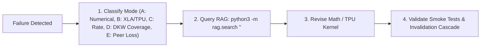

# AGENTS.md

> **Standard**: Compliant with the Linux Foundation / Agentic AI Foundation (AAIF) open standard for AI coding agents.  
> **Target Audience**: AI coding assistants (Claude Code, Cursor, Windsurf, Codex, Antigravity, goose, Copilot, A2A).

---

## 1. Project Overview & Intent

**ATLAS** (**Adaptive Taylor Landscape Analysis System**) is a budget-optimal, certified loss landscape diagnostic framework engineered for pure-attention Transformers (Vision Transformers and Causal Language Models) on hardware accelerators (Google Cloud TPU v4 Pod slices & GPUs).

### Core Scientific & Engineering Pillars
- **Exact Autodiff 2D Taylor Jets**: Evaluates scalar loss, projected gradient, and projected $2 \times 2$ Hessian $\Pi^\top \nabla^2 \mathcal{L} \Pi$ using two JVPs of a reverse-mode gradient, with no finite-difference discretization error on the selected batch.
- **Budget Allocation Surrogate**: The continuous zero-dispatch-overhead error surrogate has a conditional $C^{-3/8}$ optimum. The implementation searches feasible integer allocations under $t(B) = \tau + \kappa B$. A minimax lower bound on reconstruction risk has not been established.
- **Hermite-Taylor Partition of Unity**: The current implementation blends quadratic jets with smooth inverse-distance Shepard weights. Compact Wendland support remains a proposed, unverified variant.
- **Conditional DKW Error Certificates**: Fixed-batch domain quantiles require iid uniform holdout coordinates and sufficient sample size. The archived 14-point deterministic reports are empirical audits, not 95% certificates.
- **Formal Verification in Lean 4**: Machine-checked proofs in Mathlib without unproved axioms or `sorry` placeholders.

---

## 2. Environment & Execution Flags

- **Python Runtime**: Python 3.10+ located at `.venv/bin/python`.
- **Cloud TPU Acceleration**:
  ```bash
  export TPU_CHIPS_PER_HOST_BOUNDS="2,2,1"
  export TPU_HOST_BOUNDS="1,1,1"
  ```
- **CPU / Host Fallback (CRITICAL)**: When running tests or agents on environments without attached TPU slices, always prepend `JAX_PLATFORMS=cpu` to prevent TPU connection timeouts:
  ```bash
  JAX_PLATFORMS=cpu .venv/bin/python <script.py>
  ```
- **Lean 4 Toolchain**: Lean 4 `v4.32.1` pinned via `proofs/AtlasCert/lean-toolchain` with `lake` at `~/.elan/bin/lake`. Ensure Mathlib precompiled olean archives are retrieved via `cd proofs/AtlasCert && ~/.elan/bin/lake exe cache get` before `lake build`.
- **LaTeX Toolchain**: `pdflatex` and `bibtex` for compiling `paper/atlas.tex`.

---

## 3. Essential Commands & Tooling

Run all commands from the repository root:

```bash
# --- Smoke & Unit Tests ---
JAX_PLATFORMS=cpu .venv/bin/python test_vit_imagenet_smoke.py   # ViT on ImageNet-100 smoke test
JAX_PLATFORMS=cpu .venv/bin/python test_125m_smoke.py           # 125M FlashAttention Transformer smoke test
.venv/bin/python -m unittest rag/tests/test_rag.py              # RAG retrieval unit tests
cd proofs/AtlasCert && ~/.elan/bin/lake build                    # Machine-check formal Lean 4 proofs

# --- Research RAG Retrieval ---
.venv/bin/python -m rag.search "<query>"                        # Universal search across code, math, paper & runs
.venv/bin/python -m rag.search "alloc_lower_bound" --type proof # Filter: proof, code, paper, runs, skill
.venv/bin/python -m rag.index                                   # Rebuild semantic index (<0.2s)

# --- Autonomous Research Phases & Status ---
.venv/bin/python phases/run_phase.py --status                   # Inspect phase states & dependency graph
.venv/bin/python phases/run_phase.py --phase <N>                # Execute & verify specific phase (1-9)

# --- Experiments, Sweeps & Paper ---
make smoke_125m && make smoke_vit                               # Verify model architectures & TPU kernels
make train                                                      # Train ViT (CIFAR-10) & Transformer (WikiText-103)
make benchmark                                                  # Run multi-method budget benchmarks
make sharpness                                                  # Run curvature noise inflation audit
JAX_PLATFORMS=cpu .venv/bin/python experiments/08_vit_sweep_diagnostics.py --smoke_test  # Landscape sweep diagnostics
JAX_PLATFORMS=cpu .venv/bin/python experiments/10_hpo_peer_benchmark.py --smoke_test    # Head-to-head HPO competition
make render                                                     # Render 2D/3D figures and animated GIFs
make paper                                                      # Compile camera-ready paper/atlas.pdf
make clean                                                      # Remove pycache and LaTeX auxiliary files
```

---

## 4. Repository Topology

| Path | Purpose | Key Symbols / Files |
| :--- | :--- | :--- |
| `atlas/` | Core JAX/Flax diagnostic library | `AtlasRecorder`, `JetProbe`, `HermiteTaylorReconstruction`, `certify_reconstruction` |
| `atlas/baselines/` | Peer baseline implementations | `VectorizedGridBaseline`, `FilterNormalizedRandomSlice`, `TpuLanczosHessian`, `TpuFD` |
| `atlas/viz/` | Visualization and rendering | `render_landscape_2d`, `render_landscape_3d`, `create_landscape_gif` |
| `proofs/AtlasCert/` | Lean 4 formal verification | `AtlasCert.lean`, `Certificates.lean` (`alloc_lower_bound`, `debias_unbiased`) |
| `rag/` | Zero-overhead research RAG index | `rag.search`, `rag.index`, parsers (python, lean, latex, md), SQLite store |
| `phases/` | Autonomous self-correcting protocol| `run_phase.py`, `state.json`, `phase1.md` through `phase9.md` |
| `experiments/` | Reproducible benchmark drivers | `01_train_*.py` through `09_benchmark_vit_all_methods.py` |
| `paper/` | LaTeX paper source & output | `atlas.tex`, `refs.bib`, `atlas.pdf` |
| `skills/` | Research methodologies & guides | `theory-research`, `ml-research`, `experimental-research`, `literature-frontier` |
| `runs/` & `figures/` | Empirical metrics & plots | Metrics JSONs, certificates, 2D/3D PDFs, and animated trajectory GIFs |

---

## 5. Engineering Invariants & Coding Conventions

### JAX & Hardware Acceleration
1. **Purity & JIT**: All computation kernels must be pure functions compatible with `@jax.jit`. Keep shapes static. Manage PRNG keys explicitly via `jax.random.split(rng)`.
2. **Autodiff Integrity**: Never replace forward-over-reverse autodiff Taylor jets with finite differences in `atlas/probe.py` or core algorithms. Finite differences are strictly for baseline comparisons in `atlas/baselines/`.
3. **Double Precision for Numerical Stability**: For ill-conditioned projected Hessians, cast projection coordinates to `float32` or `float64` where appropriate. Ensure partition of unity weights never divide by zero ($\sum w_i > 10^{-12}$).
4. **Pytree Flattening**: Flatten and unflatten model parameters using `atlas.device.flatten_params` and `unflatten_params` to maintain contiguous 1D parameter vectors.

### Hermetic Data Pipelines & Synthetic Fallbacks
- All dataset ingestion loaders (`load_cifar10`, `ImageNet100Dataset`, `fineweb.py`) feature deterministic synthetic fallbacks. When local image folders or external network connections are unavailable, loaders generate reproducible, normalized synthetic batches allowing end-to-end training and landscape diagnostics to run hermetically without external dependencies.

### Formal Verification (Lean 4)
- **Zero-Axiom Rule**: All theorems in `proofs/AtlasCert/AtlasCert/Certificates.lean` must be machine-checked without `sorry` or unverified axioms. Verify using `lake build`. Ensure Mathlib precompiled oleans are fetched via `lake exe cache get`.

### Documentation & Scientific Cohesion
- Keep `paper/atlas.tex`, `README.md`, `phases/state.json`, and benchmark JSONs strictly in sync. When constants ($c_1, c_2, \kappa, \tau$) or empirical numbers change, propagate them across all artifacts.

---

## 6. Three-Tier Operational Boundaries

### Always Do
- Run unit and smoke tests (`make rag-test`, `test_vit_imagenet_smoke.py`) before committing modifications.
- Use `JAX_PLATFORMS=cpu` when running commands on environments without TPU hardware attached.
- Rebuild the RAG index (`make rag-index`) whenever code symbols, proofs, paper sections, or documentation are added or modified.
- Keep the git working tree clean and format code following PEP 8 conventions.

### Ask First
- Modifying proven mathematical minimax rates ($\mathcal{O}(C^{-3/8})$) or changing theorem formulations.
- Breaking changes to public API signatures (`AtlasRecorder`, `JetProbe`, `HermiteTaylorReconstruction`, `RenderReport`).
- Deleting pre-existing benchmark run logs in `runs/` or figures in `figures/`.

### Never Do
- **Never commit unverified Lean proofs** containing `sorry` or broken imports.
- **Never insert stochastic finite-difference approximations** into ATLAS core jet evaluation.
- **Never commit large checkpoint binaries** (`.ckpt`, `.npz`, `.bin`, `.h5`) directly into version control.
- **Never execute destructive filesystem or git commands** (e.g., `rm -rf *`, `git push --force`, `git reset --hard` to remote).

---

## 7. Autonomous Self-Correction & Triage Loop

If an experiment, benchmark, or proof fails, execute this 5-stage triage:



- Consult [`phases/README.md`](phases/README.md) for detailed cascade invalidation rules and peer dominance invariants.
- Check phase execution state via `make phase-status` and `phases/state.json`.

---

## 8. Git & Pull Request Protocol

- **Branch**: Work on feature branches or `main` as directed by project maintainers.
- **Commit Format**: Conventional Commits style:
  - `feat:` New features, kernels, or diagnostic metrics.
  - `fix:` Bug fixes, numerical stability improvements, or proof corrections.
  - `docs:` Documentation, `AGENTS.md`, `README.md`, or paper updates.
  - `refactor:` Code restructuring without behavior changes.
  - `test:` New unit tests, smoke tests, or verification scripts.
  - `perf:` XLA compilation speedups or memory optimizations.
- **Pre-Push Checklist**:
  1. `git status` reveals no untracked scratch files or unintended artifacts.
  2. `rag-test` and relevant smoke tests pass.
  3. RAG index rebuilt with `make rag-index`.
