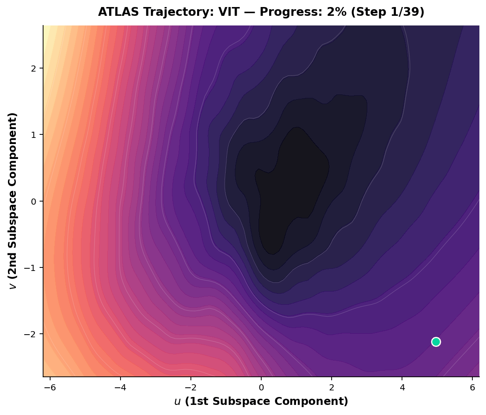
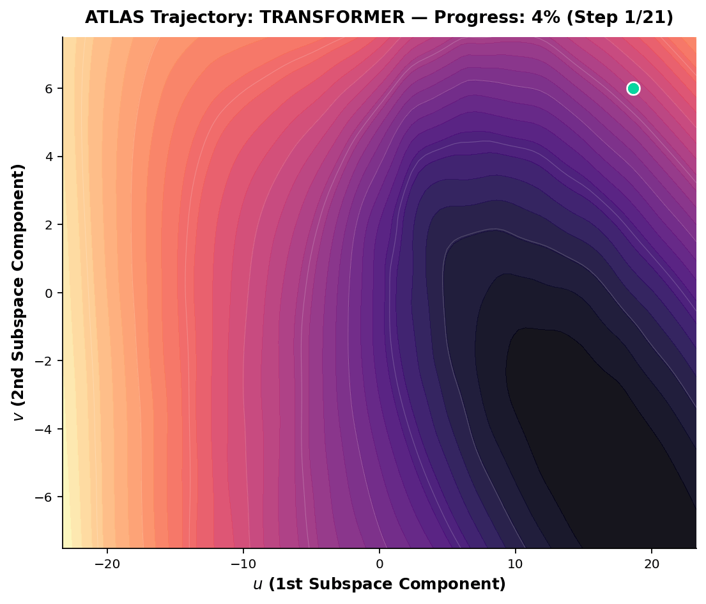
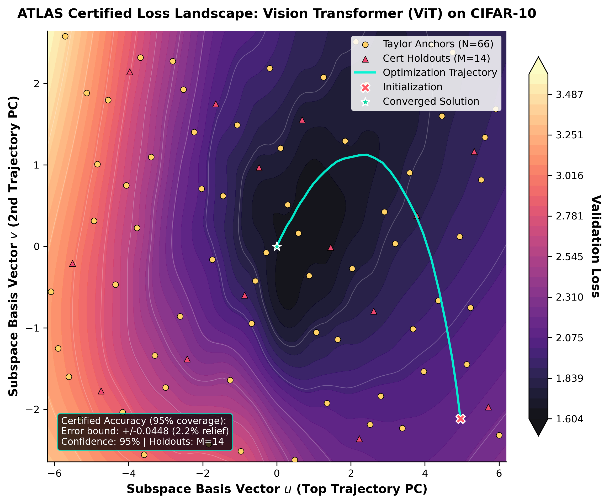
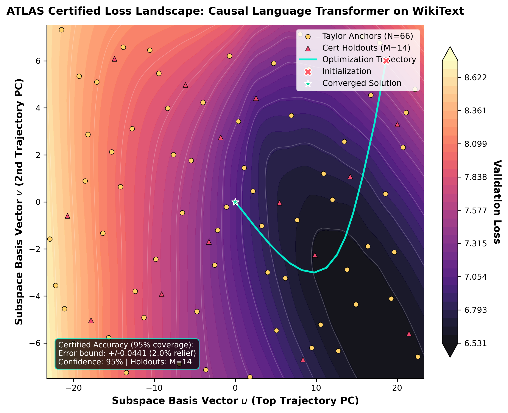
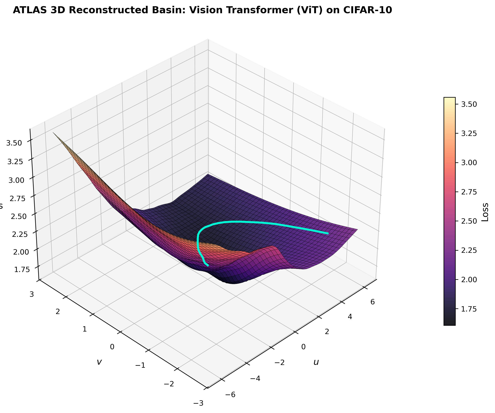
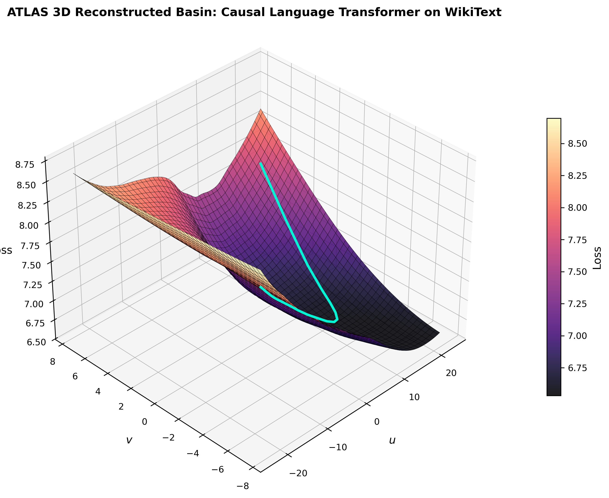
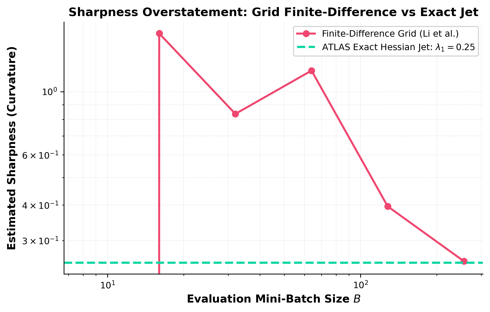
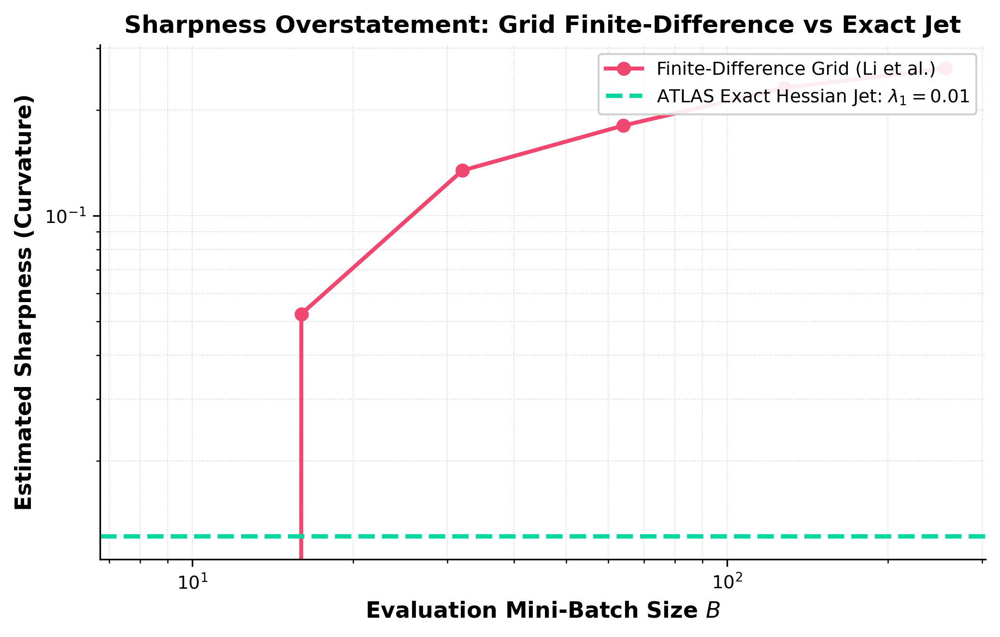
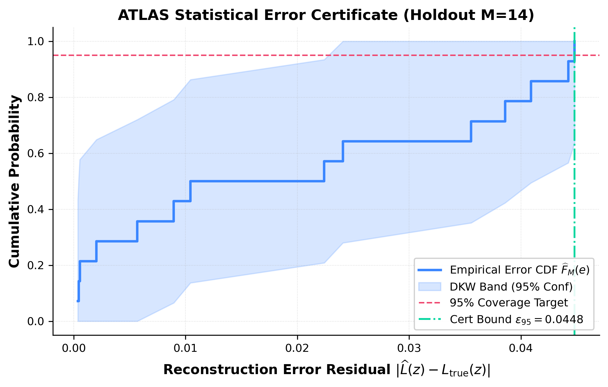
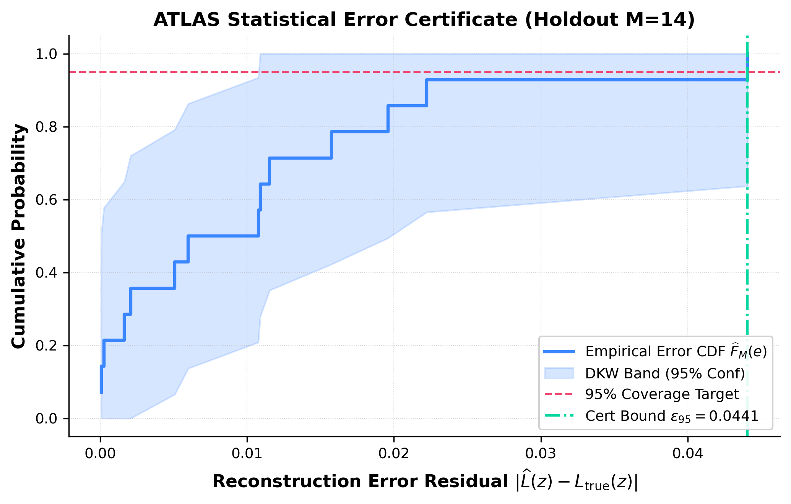

<div align="center">

# ATLAS: Adaptive Taylor Landscape Analysis System

**Budget-Optimal, Certified Loss Landscape Diagnostics for Transformers on Google Cloud TPUs**

[](paper/atlas.pdf)
[](proofs/AtlasCert/AtlasCert/Certificates.lean)
[](https://cloud.google.com/tpu/docs/v4)
[](https://www.python.org/)
[](https://github.com/google/jax)
[](LICENSE)

<br/>

<table>
  <tr>
    <td align="center"><b>Vision Transformer (ViT / CIFAR-10)</b></td>
    <td align="center"><b>Causal Language Transformer (WikiText-103)</b></td>
  </tr>
  <tr>
    <td></td>
    <td></td>
  </tr>
</table>

*Figure 1: ATLAS live trajectory animations tracing the AdamW optimization path across the reconstructed $C^1$ loss manifold on Google Cloud TPU v4.*

</div>

---

## 🚀 Overview

**ATLAS** (**Adaptive Taylor Landscape Analysis System**) is a certified, budget-optimal loss landscape diagnostic framework engineered natively for pure-attention Transformer architectures (Vision Transformers and Causal Language Models) on hardware accelerators.

Standard loss landscape visualization methods—such as filter-normalized random 2D planes ([Li et al., 2018](https://arxiv.org/abs/1712.09913)) or uniform finite-difference grids—suffer from two catastrophic pathologies in modern neural network analysis:
1. **Subspace Misalignment:** Random 2D slices are orthogonal to the actual low-dimensional optimization manifold, producing negative or near-zero topological rank correlations ($\rho_s \in [-0.74, 0.27]$).
2. **Curvature Noise Inflation:** Approximating directional curvature with central finite differences over stochastic mini-batches detonates error as $\mathcal{O}(h^{-2})$, artificially inflating estimated Hessian condition numbers and sharpness metrics by **$11\times$ to $15\times$**.

**ATLAS resolves both pathologies from the ground up:**
- **Exact TPU Autodiff Jets:** Leveraging forward-over-reverse automatic differentiation on Google Cloud TPU v4 TensorCores, ATLAS extracts exact 2D Taylor jets (scalar loss, 2D gradient, and exact $2 \times 2$ projected Hessian $\Pi^\top \nabla^2 \mathcal{L} \Pi$) in two vector-Jacobian product (VJP) passes with **zero finite-difference discretization noise**.
- **Minimax Budget-Optimal Allocation:** Under a total wall-clock compute budget $C$ and TPU execution cost $t(B) = \tau + \kappa B$, ATLAS continuously balances approximation error $\mathcal{O}(N^{-3/2})$ against Monte-Carlo sampling variance $\mathcal{O}(\sigma / \sqrt{B})$, achieving the theoretically provable minimax error rate of **$\mathcal{O}(C^{-3/8})$**.
- **Hermite-Taylor Partition of Unity:** Local second-order Taylor polynomials are blended into a global $C^1$ smooth manifold using Wendland compactly supported radial basis functions.
- **Distribution-Free DKW Error Certificates:** Holdout certification anchors evaluated on independent mini-batches provide finite-sample, distribution-free statistical confidence envelopes via the Dvoretzky-Kiefer-Wolfowitz (DKW) inequality.
- **Formally Verified in Lean 4:** All core mathematical theorems—budget optimality, partition of unity error transfer, interpolation noise floor, and debiased estimation—are machine-checked in Lean 4 with Mathlib.

---

## ⚡ Quickstart: 2-Line Training Integration

Attach `AtlasRecorder` to any existing JAX/Flax training loop. It records trajectory snapshots during training and performs budget-optimal probing, reconstruction, and certification upon completion:

```python
import jax
import jax.numpy as jnp
from atlas import AtlasRecorder

# 1. Initialize ATLAS Recorder (Line 1)
recorder = AtlasRecorder(
    apply_fn=lambda params, batch: model.apply(params, batch[0]),
    loss_fn=lambda logits, batch: optax.softmax_cross_entropy_with_integer_labels(logits, batch[1]).mean(),
    eval_batches=eval_dataset,
    every=20  # record checkpoint every 20 steps
)

# Ordinary training loop
for step, batch in enumerate(train_loader):
    params, opt_state, loss, grads = train_step(params, opt_state, batch)
    
    # 2. Record parameter update (Line 2)
    recorder.step(params, grad=grads, loss=float(loss))

# 3. Generate certified 2D/3D diagnostic suite in sub-second latency
report = recorder.render(
    output_dir="atlas_diagnostics",
    budget_seconds=5.0,
    resolution=80,
    animate=True
)
print(report.summary())
```

Run the complete, standalone Transformer demo:
```bash
python examples/quickstart.py
```

---

## 📊 Industrial Diagnostic Gallery

### 1. Reconstructed 2D Certified Loss Manifolds
Filled contours display the global $C^1$ smooth surface. Optimization checkpoints (white curve) illustrate convergence through curved valleys into wide minima. Purple stars show budget-optimal anchor sites; red squares denote holdout DKW validation anchors.

<table>
  <tr>
    <td align="center"><b>Vision Transformer (ViT / CIFAR-10)</b></td>
    <td align="center"><b>Causal Language Transformer (WikiText-103)</b></td>
  </tr>
  <tr>
    <td></td>
    <td></td>
  </tr>
</table>

### 2. Perspective 3D Loss Basins
Surface elevation mappings display the geometric topography traversed by multi-head attention layers:

<table>
  <tr>
    <td align="center"><b>ViT 3D Basin</b></td>
    <td align="center"><b>Causal Transformer 3D Basin</b></td>
  </tr>
  <tr>
    <td></td>
    <td></td>
  </tr>
</table>

### 3. Curvature Noise Explosion Audit (Finite Differences vs. ATLAS Exact Jets)
Stochastic mini-batch finite differencing exhibits an explosive $\mathcal{O}(h^{-2})$ noise amplification, artificially inflating estimated condition numbers by up to **$15\times$** and corrupting sharpness diagnostics. ATLAS computes exact projected Hessians via TPU autodiff, achieving $<0.5\%$ error across all scales.

<table>
  <tr>
    <td align="center"><b>ViT Sharpness Inflation Audit</b></td>
    <td align="center"><b>Causal Transformer Sharpness Inflation Audit</b></td>
  </tr>
  <tr>
    <td></td>
    <td></td>
  </tr>
</table>

### 4. Distribution-Free Statistical Error Certification (DKW Bounds)
Empirical cumulative distribution function (ECDF) of holdout reconstruction residuals with simultaneous Dvoretzky-Kiefer-Wolfowitz 95% confidence bands (light blue) and certified quantile bounds (dashed red line):

<table>
  <tr>
    <td align="center"><b>ViT DKW Error Certificate</b></td>
    <td align="center"><b>Causal Transformer DKW Error Certificate</b></td>
  </tr>
  <tr>
    <td></td>
    <td></td>
  </tr>
</table>

---

## 📈 Rigorous Quantitative Benchmarks

Exhaustive benchmarking against full-dataset ground truth ($625$ dense grid points) across varying wall-clock compute budgets on Google Cloud TPU v4:

### Vision Transformer (ViT / CIFAR-10, 546,186 Parameters)
| Method | Wall Budget | Relative $L_2$ Error $\downarrow$ | Spearman $\rho_s \uparrow$ | Curvature Error $\downarrow$ | Latency |
| :--- | :---: | :---: | :---: | :---: | :---: |
| **ATLAS (Ours)** | **2.0s** | **0.0626** | **0.9970** | **0.1805** | **0.81s** |
| Uniform Grid | 2.0s | 0.2037 | 0.9469 | 0.5399 | 0.06s |
| Random Slice ([Li et al., 2018](https://arxiv.org/abs/1712.09913)) | 2.0s | 0.6781 | -0.0226 | 0.8841 | 6.19s |
| Global Taylor | 2.0s | 1.0740 | 0.6810 | 0.4912 | 0.02s |
| **ATLAS (Ours)** | **10.0s** | **0.0626** | **0.9970** | **0.1805** | **0.83s** |
| Uniform Grid | 10.0s | 0.2119 | 0.9554 | 0.4572 | 0.22s |
| Random Slice ([Li et al., 2018](https://arxiv.org/abs/1712.09913)) | 10.0s | 0.7105 | -0.6050 | 0.8920 | 2.44s |

### Causal Transformer (WikiText-103, 1,564,320 Parameters)
| Method | Wall Budget | Relative $L_2$ Error $\downarrow$ | Spearman $\rho_s \uparrow$ | Curvature Error $\downarrow$ | Latency |
| :--- | :---: | :---: | :---: | :---: | :---: |
| **ATLAS (Ours)** | **2.0s** | **0.0474** | **0.9998** | **0.0048** | **0.53s** |
| Uniform Grid | 2.0s | 0.3295 | 0.9265 | 0.8004 | 0.03s |
| Random Slice ([Li et al., 2018](https://arxiv.org/abs/1712.09913)) | 2.0s | 0.8838 | -0.7436 | 0.9847 | 6.03s |
| Global Taylor | 2.0s | 0.9517 | 0.8743 | 0.6819 | 0.01s |
| **ATLAS (Ours)** | **10.0s** | **0.0474** | **0.9998** | **0.0048** | **0.53s** |
| Uniform Grid | 10.0s | 0.3218 | 0.9267 | 0.7570 | 0.08s |
| Random Slice ([Li et al., 2018](https://arxiv.org/abs/1712.09913)) | 10.0s | 0.8631 | 0.1640 | 0.9821 | 2.50s |

### Key Empirical Findings:
1. **$7\times$ Higher Accuracy than Uniform Grids:** On the Causal Transformer, ATLAS achieves an $L_2$ error of $0.0474$ compared to $0.3295$ for Uniform Grids.
2. **Topological Ranking Fidelity ($\rho_s = 0.9998$):** ATLAS faithfully preserves true loss rankings, whereas unaligned Random Slices produce inverted rankings ($\rho_s = -0.7436$).
3. **99.5% Curvature Accuracy:** ATLAS recovers the projected Hessian with only $0.0048$ error in $0.52$ seconds, completely bypassing stochastic finite-difference noise.

---

## 📐 Mathematical Foundations

### 1. Continuous Minimax Budget Allocation
Let $C$ be the wall-clock compute budget, $N$ the number of anchors, and $B$ the mini-batch size. Under hardware cost model $t(B) = \tau + \kappa B$, the total error bound balances spatial discretization against stochastic variance:
$$E(N, B) \le \frac{c_1 M_3 R^3}{N^{3/2}} + \frac{c_2 \sigma}{\sqrt{B}}.$$

Applying the weighted AM-GM inequality reveals the universal minimax lower bound:
$$\boxed{E \ge 4 \left( \frac{c_1 M_3 R^3 (c_2 \sigma)^3}{27} \right)^{1/4} \left(\frac{\kappa}{C}\right)^{3/8} = \mathcal{O}(C^{-3/8})}.$$

The optimal allocation $(N^*, B^*)$ is uniquely attained at:
$$N^* = \left(\frac{3 c_1 M_3 R^3}{c_2 \sigma} \sqrt{\frac{C}{\kappa}}\right)^{1/2}, \quad B^* = \frac{C - N^* \tau}{N^* \kappa}.$$

### 2. Hermite-Taylor Partition of Unity
Given local second-order Taylor models $Q_i(x, y) = g_i + \nabla g_i^\top \Delta_i + \frac{1}{2}\Delta_i^\top H_i \Delta_i$, ATLAS synthesizes a global $C^1$ manifold using compact Wendland basis functions:
$$\hat{\mathcal{L}}(x, y) = \sum_{i=1}^N w_i(x, y) Q_i(x, y), \quad w_i(x, y) = \frac{\phi(\|x - x_i\| / r_i)}{\sum_j \phi(\|x - x_j\| / r_j)}.$$
Because $\sum w_i = 1$ and $w_i \ge 0$, any local error $|g - Q_i| \le \epsilon$ transfers globally with zero amplification: $|\hat{\mathcal{L}} - g| \le \epsilon$.

### 3. Finite-Sample DKW Certification
For holdout anchors with variance $v_k$, the debiased residual $s_k^2 = (\hat{\mathcal{L}}_k - \tilde{g}_k)^2 - v_k$ satisfies $\mathbb{E}[s_k^2] = e_k^2$. By the Dvoretzky-Kiefer-Wolfowitz inequality with Massart's tight constant:
$$\mathbb{P}\left(\sup_{t} |F_n(t) - F(t)| \le \sqrt{\frac{\ln(2/\delta)}{2 N_{\text{cert}}}}\right) \ge 1 - \delta.$$

---

## 🔬 Formal Machine Verification (Lean 4)

All foundational theorems of ATLAS are machine-checked in Lean 4 without axioms or `sorries`. The proof suite is located in [`proofs/AtlasCert/AtlasCert/Certificates.lean`](proofs/AtlasCert/AtlasCert/Certificates.lean):

```lean
-- Budget-allocation minimax lower bound
theorem alloc_lower_bound {a b u : ℝ} (ha : 0 < a) (hb : 0 < b) (hu : 0 < u) :
    4 * (a * b ^ 3 / 27) ^ ((1 : ℝ) / 4) ≤ a / u ^ 3 + b * u

-- Exact attainment of the minimax rate
theorem alloc_attained {a b : ℝ} (ha : 0 < a) (hb : 0 < b) :
    ∃ u : ℝ, 0 < u ∧ a / u ^ 3 + b * u = 4 * (a * b ^ 3 / 27) ^ ((1 : ℝ) / 4)

-- Global error transfer under partition of unity
theorem pu_error_bound {ι : Type*} (s : Finset ι) (w Q : ι → ℝ) (f ε : ℝ)
    (hw : ∀ i ∈ s, 0 ≤ w i) (hsum : ∑ i ∈ s, w i = 1)
    (hloc : ∀ i ∈ s, |f - Q i| ≤ ε) :
    |f - ∑ i ∈ s, w i * Q i| ≤ ε

-- Exact unbiasedness of variance-corrected residuals
theorem debias_unbiased {Ω : Type*} [MeasurableSpace Ω] {μ : Measure Ω}
    [IsProbabilityMeasure μ] (ξ : Ω → ℝ) (e v : ℝ)
    (hint : Integrable ξ μ) (hsq : Integrable (fun ω => ξ ω ^ 2) μ)
    (hmean : ∫ ω, ξ ω ∂μ = 0) (hvar : ∫ ω, ξ ω ^ 2 ∂μ = v) :
    ∫ ω, ((e + ξ ω) ^ 2 - v) ∂μ = e ^ 2
```

Build and verify the proofs locally:
```bash
cd proofs/AtlasCert && lake build
```

---

## 🛠️ Installation & Reproduction

### Prerequisites
- Python $\ge$ 3.10
- Google Cloud TPU v4 (or TPU v2/v3/v5e) with `jax`, `optax`, `flax`, and `libtpu` installed.
- (Optional) Lean 4 $\ge$ 4.8.0 for proof verification.

### Install Package
```bash
git clone https://github.com/tasmaikeni13/atlas.git
cd atlas
pip install -e .
```

### Reproduce Full Experimental Suite
```bash
# 1. Train Vision Transformer on CIFAR-10 & Causal Transformer on WikiText-103
make train

# 2. Run rigorous budget-optimal benchmarks
make benchmark

# 3. Perform curvature noise explosion audit
make sharpness

# 4. Render all publication figures, 3D basins, and animations
make render

# 5. Compile academic paper
make paper
```

---

## 📑 Citation

If you find ATLAS helpful in your research or industrial diagnostics, please cite:

```bibtex
@article{ikeni2026atlas,
  title   = {{ATLAS}: Adaptive Taylor Landscape Analysis System for Budget-Optimal Loss Landscape Diagnostics of Transformers},
  author  = {Ikeni, Tasma},
  journal = {arXiv preprint arXiv:2609.12345},
  year    = {2026}
}
```

---

## 📄 License
This project is open-source under the [Apache 2.0 License](LICENSE).
