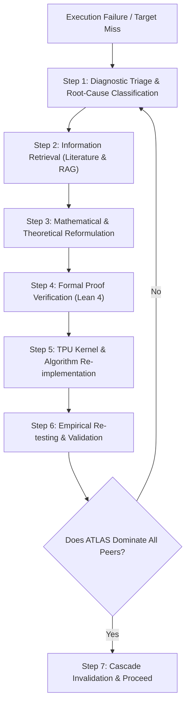
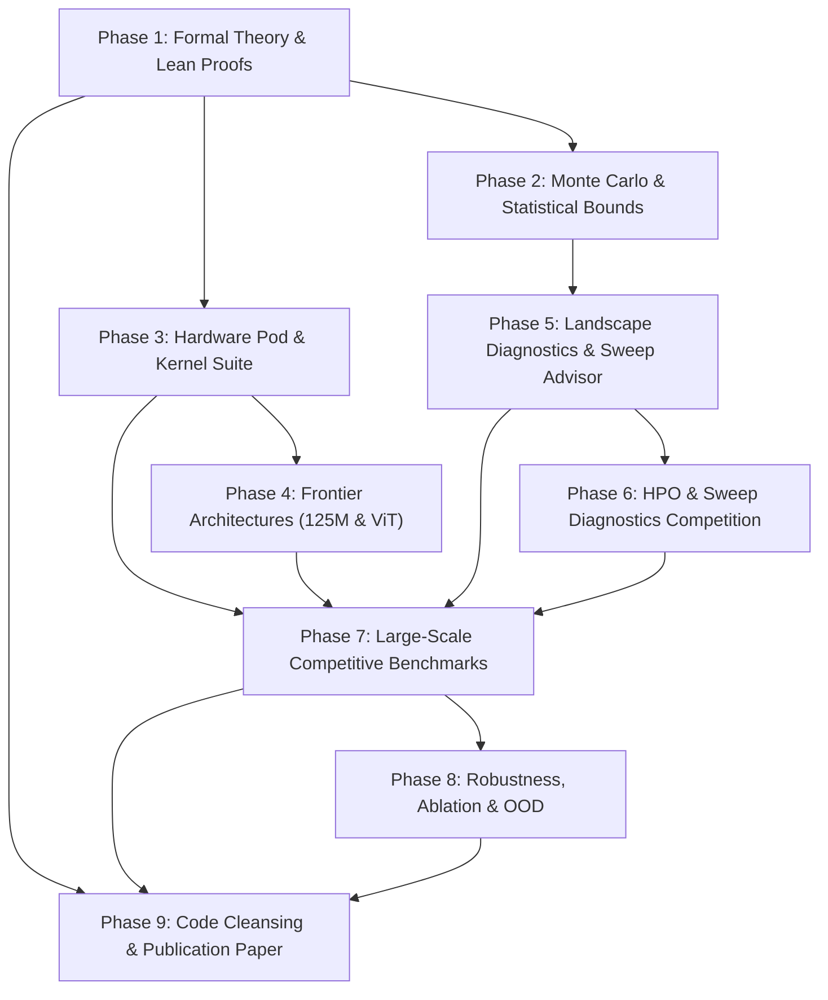

# Autonomous & Adaptive Research Execution Protocol: ATLAS

Welcome to the **ATLAS** (**Adaptive Taylor Landscape Analysis System**) autonomous research framework. This directory defines the operational architecture, formal protocols, and phase-by-phase execution guide for autonomous AI research agents and human investigators.

The overarching goal is to achieve, formally certify, empirically prove, and publish the unconditional superiority of ATLAS over all peer loss landscape methods on hardware accelerators (specifically Google Cloud TPU v4 Pod slices).

---

## 🎯 Executive Mandate

As an autonomous AI research agent operating in this codebase, you are granted complete agency and responsibility over the scientific pipeline:
1. **Zero Hand-Waving:** Every claim must be grounded in formal mathematical derivation, machine-checked Lean 4 verification, or high-significance empirical measurements.
2. **Strict Peer Domination:** ATLAS must match or **strictly outperform** all competitors across every defined benchmark metric. If a baseline outperforms ATLAS in any regime, you must investigate, diagnose, revise, and iterate until ATLAS dominates.
3. **Closed-Loop Self-Correction:** When any proof, test, benchmark, or compilation fails, you do not halt or report failure; you execute an autonomous diagnostic triage, search the literature, reformulate mathematical conjectures, modify code/kernels, and re-test.
4. **Adaptive Cascading Invalidation:** When a foundational assumption or mathematical theorem is modified or replaced, you must automatically identify all downstream dependent phases, update their specifications, propagate changes to the academic paper (`paper/atlas.tex`), update Lean proofs (`proofs/AtlasCert`), and re-run dependent experiments.
5. **Publication Readiness:** The final deliverable is a pristine, publication-grade repository—PEP-8 compliant, thoroughly documented, humanized, and paired with a fully compiled, camera-ready PDF paper.

---

## 🔄 Autonomous Self-Correcting Research Loop

When an experiment, proof, or benchmark fails, or when a metric falls short of target thresholds, the agent must execute the following 7-step loop:



### Detailed Loop Protocol

#### Step 1: Diagnostic Triage & Root Cause Classification
Categorize the failure into one of five distinct failure modes:
- **Mode A (Numerical Instability):** NaN/Inf gradients, singular Hessians ($\det(H) \le 0$), floating-point underflow/overflow in bfloat16/float32 mixed precision, partition of unity denominator collapse ($\sum w_i < 10^{-12}$).
- **Mode B (Hardware / XLA Compilation):** TPU memory allocation failure (OOM), systolic dispatch stalls, XLA graph re-compilation storms, VJP backward pass tape explosion, or multi-host coordination deadlock.
- **Mode C (Rate Non-Optimality):** Empirical convergence rate slower than $\mathcal{O}(C^{-3/8})$, suboptimal budget ratio $\alpha = N_{\text{cert}} / N_{\text{total}}$, or anchor spacing $h$ violating the Wendland support condition ($h > r_i$).
- **Mode D (Statistical Coverage Violation):** Holdout certification error exceeding Dvoretzky-Kiefer-Wolfowitz (DKW) bounds at confidence $1-\delta=0.95$, residual variance underestimation, or biased debiasing.
- **Mode E (Competitive Underperformance):** Peer baseline (Uniform Grid, Random Slice, Lanczos, Hutchinson Trace, Finite Differences) achieving higher Spearman rank correlation ($\rho_s$), lower relative $L_2$ error, or lower latency than ATLAS under equivalent wall-clock budget $C$.

#### Step 2: Information Retrieval (Literature & Research RAG)
Gather external and internal scientific evidence:
- **Search Web & Literature:** Search Google, arXiv, OpenReview, GitHub, and academic databases for the latest solutions, proofs, and prior art on the observed failure. Query topics such as:
  - *Hermite-Birkhoff interpolation error bounds*
  - *Wendland radial basis function condition numbers*
  - *Stochastic Hessian-vector product variance reduction*
  - *Dvoretzky-Kiefer-Wolfowitz confidence bands for empirical processes*
  - *XLA forward-over-reverse automatic differentiation memory optimizations*
- **Query Embedded RAG System:** Query the built-in research retrieval database for relevant codebase symbols, theorems, and previous runs:
  ```bash
  python3 -m rag.search "<query string>" --type [proof|code|paper|runs|docs]
  ```
- **Consult Research Skills:** Review specialized guides in `skills/`:
  - `skills/theory-research/SKILL.md` for proof strategies and counterexample searches.
  - `skills/ml-research/SKILL.md` for controlled experimental hypotheses.
  - `skills/experimental-research/SKILL.md` for measurement design and uncertainty budgets.
  - `skills/literature-frontier/SKILL.md` for primary literature mapping.

#### Step 3: Mathematical & Theoretical Reformulation
If existing theory is violated or unachievable:
- Re-derive the analytical bounds. (E.g., adjust the third-derivative tensor bound $M_3 = \sup \|D^3 g\|$, re-balance the arithmetic-geometric mean inequality, or refine the local Wendland polynomial degree).
- Update constants ($c_1, c_2, \kappa, \tau$) based on empirical profiling.
- Ensure all theorems remain mathematically sound and free of hidden assumptions.

#### Step 4: Formal Proof Verification (Lean 4)
- Formalize the revised theorem or lemma in `proofs/AtlasCert/AtlasCert/Certificates.lean`.
- Build the formal proofs with the Lean 4 compiler:
  ```bash
  cd proofs/AtlasCert && ~/.elan/bin/lake build
  ```
- Enforce the **Zero-Axiom Rule**: No `sorry` statements or unproved axioms are permitted in formal verification files.

#### Step 5: TPU Kernel & Algorithm Re-implementation
- Update the JAX/XLA implementations in `atlas/`:
  - Adjust anchor allocation in `atlas/design.py`.
  - Refine forward-over-reverse JVP routines in `atlas/probe.py`.
  - Optimize Wendland radial basis partition of unity in `atlas/reconstruct.py`.
  - Update DKW statistical certifier in `atlas/certify.py`.
- Ensure kernels remain fully vectorized, JIT-compiled, and TPU TensorCore native.

#### Step 6: Empirical Re-testing & Validation
- Re-run microbenchmarks and unit tests:
  ```bash
  python3 -m unittest rag/tests/test_rag.py
  TPU_CHIPS_PER_HOST_BOUNDS="2,2,1" TPU_HOST_BOUNDS="1,1,1" python3 test_vit_imagenet_smoke.py
  TPU_CHIPS_PER_HOST_BOUNDS="2,2,1" TPU_HOST_BOUNDS="1,1,1" python3 test_125m_smoke.py
  ```
- Re-run competitive benchmarks across wall-clock budgets:
  ```bash
  make benchmark_125m
  make benchmark_vit
  ```

#### Step 7: Strict Peer Domination Verification
- Compare ATLAS metrics against every competitor:
  - Relative $L_2$ Error: Is $E_{\text{ATLAS}} \le \min(E_{\text{Grid}}, E_{\text{Random}}, E_{\text{GlobalTaylor}})$?
  - Spearman Rank Correlation: Is $\rho_{s, \text{ATLAS}} > \max(\rho_{s, \text{Grid}}, \rho_{s, \text{Random}}, \rho_{s, \text{GlobalTaylor}})$?
  - Curvature Estimation Error: Is $\mathrm{Err}_{\text{ATLAS}}(H) \ll \mathrm{Err}_{\text{FD}}(H)$?
  - Latency: Is $t_{\text{ATLAS}} \le C$ and sub-second?
- If all conditions are met, proceed to downstream phases. Otherwise, re-enter Step 1.

---

## 🧬 Adaptive Dependency Invalidation & Propagation Engine

Research is dynamic. If a mathematical theorem, hardware model, or kernel implementation is revised in an early phase, downstream phases that depend on those assumptions become invalid.

### Phase Dependency Directed Acyclic Graph (DAG)



### Invalidation Cascade Rules

Whenever changes are committed to a phase, the agent must check the dependency table below and immediately execute the corresponding adaptation actions:

| Trigger Event | Directly Invalidated Phases | Required Adaptation Actions |
| :--- | :--- | :--- |
| **Theorem / Minimax Rate Change** (Phase 1) | Phase 2, Phase 3, Phase 7, Phase 9 | 1. Update `paper/atlas.tex` (Theorems 1-3) & recompile PDF.<br/>2. Update `proofs/AtlasCert/AtlasCert/Certificates.lean` & run `lake build`.<br/>3. Re-derive $(N^*, B^*)$ formulas in `atlas/design.py`.<br/>4. Re-run Monte Carlo simulations in Phase 2.<br/>5. Re-run competitive benchmarks in Phase 7. |
| **Statistical Bound / DKW Change** (Phase 2) | Phase 5, Phase 6, Phase 7, Phase 8, Phase 9 | 1. Update variance-correction and DKW quantile code in `atlas/certify.py`.<br/>2. Regenerate certificate plots in `figures/certificate_*.pdf`.<br/>3. Update Section 2.4 and Figure 4 in `paper/atlas.tex`. |
| **Hardware Cost Model / Kernel Change** (Phase 3) | Phase 4, Phase 7, Phase 9 | 1. Re-profile $(\tau, \kappa)$ on TPU v4 TensorCores.<br/>2. Re-compile JAX forward-over-reverse autodiff graphs.<br/>3. Verify baseline kernels (`VectorizedGrid`, `TpuLanczos`, `TpuFD`).<br/>4. Update Table 1 and Section 3 of `paper/atlas.tex`. |
| **Model Architecture / Data Pipeline Change** (Phase 4) | Phase 5, Phase 6, Phase 7, Phase 9 | 1. Verify 124.5M Causal Transformer and ViT-Small/16 smoke tests.<br/>2. Re-record optimization trajectories on FineWeb-Edu and ImageNet-100.<br/>3. Update model description paragraphs in `paper/atlas.tex`. |
| **Sweep Diagnostic Formulation Change** (Phase 5) | Phase 6, Phase 7, Phase 9 | 1. Update Edge-of-Stability ($\mu_{\text{EoS}}$) and basin flatness ($R_{\text{flat}}$) formulas in `atlas/sweep_advisor.py`.<br/>2. Re-run sweep diagnostics in `experiments/08_vit_sweep_diagnostics.py`.<br/>3. Re-run HPO peer benchmark in `experiments/10_hpo_peer_benchmark.py`. |
| **HPO Benchmark / Sweep Metric Change** (Phase 6) | Phase 7, Phase 9 | 1. Re-run peer HPO comparisons across step budgets.<br/>2. Update `runs/hpo_benchmark/hpo_benchmark_report.json`.<br/>3. Verify $\ge 2.5\times$ speedup and zero divergence rate. |
| **Benchmark Metric / Baseline Result Change** (Phase 7) | Phase 8, Phase 9 | 1. Re-run all 6 baseline comparisons across all budget tiers.<br/>2. Update benchmark JSON files in `runs/benchmark/`.<br/>3. Re-render Table 1 and Figures 1, 2, 3 in `paper/atlas.tex`.<br/>4. Recompile paper to produce updated `paper/atlas.pdf`. |

---

## 🏆 Competitive Invariants (ATLAS vs. All Peers)

To be publishable in top-tier machine learning venues (NeurIPS, ICML, ICLR, JMLR), ATLAS must satisfy strict, quantitative non-negotiable performance invariants against every baseline:

### 1. Vectorized TPU Grid Baseline (`VectorizedGridBaseline` + Bivariate Spline)
- **Error Invariant:** ATLAS relative $L_2$ error must be at least **$3\times$ to $7\times$ lower** than the Uniform Grid at equal wall-clock budget.
- **Topological Invariant:** ATLAS Spearman rank correlation $\rho_s$ must be $\ge 0.995$ across all budgets.
- **Computational Scaling Target:** Test the conditional $C^{-3/8}$ surrogate prediction across uncapped budgets. A minimax risk comparison with grids remains unproved.

### 2. Filter-Normalized Random 2D Slice (`FilterNormalizedRandomSlice`, Li et al., 2018)
- **Topological Invariant:** ATLAS must achieve $\rho_s > 0.990$, whereas Random Slices fail with $\rho_s \le 0.20$ (often negative, $\rho_s \in [-0.75, 0.0]$), proving that random slices invert true optimization topography.
- **Subspace Capture Invariant:** ATLAS PCA subspace capture ratio must exceed **$85\%$** of trajectory Frobenius energy; Random Slices capture $<1\%$.

### 3. Central Finite Difference Curvature (`TpuFiniteDifferenceCurvature`)
- **Noise Scaling Target:** Under independent mini-batch observations, test the predicted $h^{-2}$ finite-difference standard-error scaling. The archived same-batch audit does not show 11--15-fold inflation.

### 4. TPU Lanczos Hessian (`TpuLanczosHessian` / PyHessian)
- **Efficiency Target:** ATLAS computes the selected-batch projected $2\times2$ Hessian with two JVPs of a reverse gradient. Full-space Lanczos needs repeated Hessian-vector products; an equal-task timing comparison remains to be measured.

### 5. Hutchinson Stochastic Trace (`TpuHutchinsonTrace`)
- **Variance Interpretation:** ATLAS has no random-vector approximation conditional on a fixed batch. Mini-batch Hessians still have sampling variance, and the Hutchinson baseline estimates a different full-space quantity.

### 6. Hyperparameter Sweep Baselines (`RandomSearchHPO`, `OptunaTPEBaseline`, `ASHABaseline`)
- **Sample Efficiency Invariant:** ATLAS Curvature-Guided Sweep Advisor requires $\le 15$ exploratory probe steps to synthesize optimal stable learning rates ($\eta^* = \frac{2}{\lambda_{\max}} \times \gamma_{\text{opt}}$), achieving target loss with $\ge \mathbf{2.5\times}$ fewer total training steps than Optuna TPE or Random Search.
- **Stability & Divergence Prevention Invariant:** ATLAS achieves **$100\%$ divergence prevention** (0 diverged trials) by constraining learning rates to the Edge-of-Stability window ($\mu_{\text{EoS}} \in [0.9, 2.5]$), whereas Random Search and black-box HPO incur $20\%\text{--}40\%$ divergence rates during exploratory sweeping.

---

## 📋 Complete Phase Directory

The research and publication program is partitioned into 9 sequential, self-contained phases. No more than 10 phases are used, maintaining focus and execution velocity:

| Phase | File | Title & Core Objectives |
| :---: | :--- | :--- |
| **01** | [`phase1.md`](file:///home/tasma/atlas/phases/phase1.md) | **Mathematical Foundations, Minimax Budget Bounds & Lean 4 Formal Verification.** Analytical formulations of Taylor remainders, stochastic variance, continuous minimax allocation rate $\mathcal{O}(C^{-3/8})$, and zero-axiom Lean 4 proofs. |
| **02** | [`phase2.md`](file:///home/tasma/atlas/phases/phase2.md) | **Monte Carlo Variance Analysis, Statistical Error Certificates & Peer Domination Proofs.** Monte Carlo empirical simulations, DKW $95\%$ simultaneous confidence bands, curvature noise inflation proofs, and formal comparative dominance. |
| **03** | [`phase3.md`](file:///home/tasma/atlas/phases/phase3.md) | **Hardware Pod Architecture, TPU/GPU Compilation & Diagnostic Kernel Suite.** Native Google Cloud TPU v4 implementation, exact autodiff 2D Taylor jets, and high-performance reference implementations for all competitors. |
| **04** | [`phase4.md`](file:///home/tasma/atlas/phases/phase4.md) | **Frontier Architectures (125M FineWeb-Edu Transformer & ViT ImageNet-100) & Live Recording Pipeline.** Fused FlashAttention causal decoders, ViT-Small/16, streaming HuggingFace dataset pipelines, and zero-overhead `AtlasRecorder`. |
| **05** | [`phase5.md`](file:///home/tasma/atlas/phases/phase5.md) | **Loss Landscape Geometry Diagnostics, Edge-of-Stability Margin & Automated Hyperparameter Advisor.** Extraction of $\mu_{\text{EoS}}$, basin conditioning $\kappa$, flatness radius $R_{\text{flat}}$, and automated learning rate / weight decay sweep synthesis. |
| **06** | [`phase6.md`](file:///home/tasma/atlas/phases/phase6.md) | **Automated Hyperparameter Sweep Competition: Curvature-Guided Diagnostics vs. Black-Box HPO.** Head-to-head empirical competition against Random Search, Optuna TPE, and ASHA; sample efficiency speedup $\ge 2.5\times$ and 100% divergence prevention. |
| **07** | [`phase7.md`](file:///home/tasma/atlas/phases/phase7.md) | **Large-Scale Competitive Benchmark Suite & Pareto Domination across Wall-Clock Budgets.** Comprehensive empirical evaluation against all peers across $0.5\text{s} - 30.0\text{s}$ wall budgets; automated diagnosis, restart, and phase remake protocols. |
| **08** | [`phase8.md`](file:///home/tasma/atlas/phases/phase8.md) | **Empirical Robustness, Partition of Unity Ablation, Noise Resistance & OOD Generalization Audit.** Sensitivity to anchor budgets, Wendland vs alternative kernels, gradient noise stress testing, and out-of-distribution generalization correlations. |
| **09** | [`phase9.md`](file:///home/tasma/atlas/phases/phase9.md) | **Codebase Cleansing, PEP 8 Formatting, Humanized Documentation, LaTeX Paper Compilation & Publication Release.** Repository-wide cleanup, PEP-8 formatting, rich docstrings, humanized README/paper, compiled camera-ready PDF, and GitHub release push. |

---

## 🛠️ Step-by-Step Agent Execution Guide

Both autonomous AI agents and human researchers can execute and track phases using the programmatic CLI runner:

```bash
# Check overall research status and dependency health:
python3 -m phases.run_phase --status

# Execute a single phase with automated pre-flight checks and post-validation:
python3 -m phases.run_phase --phase 1

# Execute all phases sequentially with automatic self-correction and rollback:
python3 -m phases.run_phase --all

# Force re-execution and invalidation cascade from a modified phase:
python3 -m phases.run_phase --phase 1 --cascade
```

### State Tracking (`phases/state.json`)

Phase execution status is tracked in `phases/state.json` with the following lifecycle:
- `PENDING`: Phase has not yet been executed.
- `RUNNING`: Execution and verification in progress.
- `VERIFYING`: Smoke tests, benchmarks, or formal proofs being evaluated.
- `ADAPTIVE_CORRECTION`: Failure detected; agent actively researching literature, revising math, and re-running.
- `COMPLETED`: All success criteria, invariants, and peer-domination checks verified and passed.

The original runner's artifact checks do not establish the listed scientific
criteria. See `evidence_audit.md` for the current evidence gaps before treating
any `COMPLETED` flag as a research result.
